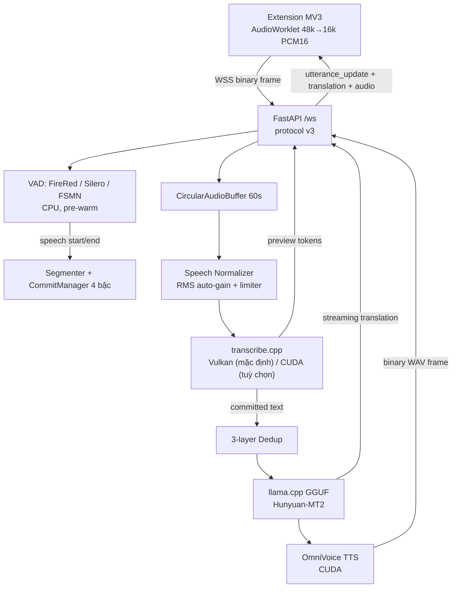

# Vibe Translation Addon — Phụ đề song ngữ thời gian thực + Dịch neural + Lồng tiếng (transcribe.cpp)

[](https://www.python.org/)
[](https://fastapi.tiangolo.com/)
[](https://developer.mozilla.org/docs/Mozilla/Add-ons/WebExtensions)
[-76B900.svg)](external/transcribe.cpp)
[](#-giấy-phép)

Hệ thống **chạy hoàn toàn ngoại tuyến** (100 % local inference) biến mọi video trên trình duyệt
thành video có **phụ đề song ngữ + giọng thuyết minh**, không gửi dữ liệu ra Internet:

```
Audio tab (extension) → VAD → ASR (transcribe.cpp) → cắt câu → Dịch GGUF → Phụ đề + TTS
```

Đo trên máy tham chiếu (**RTX 5060 Ti 16 GB**): commit câu p50 **~107 ms**, preview p95 **108 ms**,
token dịch đầu tiên **26 ms**, VRAM đỉnh **~9,5 GB** cho cả 4 model (ASR + VAD + dịch 7B + TTS).

Repository: [github.com/khachuy279/vibe-translation-addon-transcribe_cpp](https://github.com/khachuy279/vibe-translation-addon-transcribe_cpp)

> [!IMPORTANT]
> **Thiết kế cho sử dụng cá nhân: tối đa 1 phiên / 1 video.** ASR, dịch và TTS đều là singleton dùng
> chung; thư viện `transcribe.cpp` 0.x chỉ cho **một** stream in-flight trên mỗi model
> (`external/transcribe.cpp/include/transcribe.h`). Muốn N phiên song song phải nạp N bản model.
> Xem [Hạn chế đã biết](#-hạn-chế-đã-biết) và báo cáo audit đầy đủ trong `report/audit/`.

---

## 📑 Mục lục

- [Tính năng chính](#-tính-năng-chính)
- [Yêu cầu hệ thống](#-yêu-cầu-hệ-thống)
- [Cài đặt](#-cài-đặt)
  - [Cách nhanh (khuyến nghị)](#cách-nhanh-khuyến-nghị)
  - [Cài đặt chi tiết (từng bước)](#cài-đặt-chi-tiết-từng-bước)
  - [Bundle ASR CUDA (backend mặc định)](#bundle-asr-cuda-backend-mặc-định)
- [Chuẩn bị mô hình](#-chuẩn-bị-mô-hình)
- [Khởi chạy backend](#-khởi-chạy-backend)
- [Cài extension & sử dụng](#-cài-extension--sử-dụng)
- [Kiến trúc & luồng dữ liệu](#-kiến-trúc--luồng-dữ-liệu)
- [Giao thức WebSocket (v3)](#-giao-thức-websocket-v3)
- [REST API](#-rest-api)
- [Cấu hình quan trọng](#-cấu-hình-quan-trọng)
- [Kiểm thử](#-kiểm-thử)
- [Kết quả đo](#-kết-quả-đo)
- [Khắc phục sự cố](#-khắc-phục-sự-cố)
- [Hạn chế đã biết](#-hạn-chế-đã-biết)
- [Cấu trúc thư mục](#-cấu-trúc-thư-mục)
- [Giấy phép](#-giấy-phép)

---

## ✨ Tính năng chính

| Nhóm | Chi tiết |
| :--- | :--- |
| **Phụ đề** | Phụ đề gốc hiện **dần** (preview) rồi **chốt** khi hết câu; bản dịch hiện song song. Tuỳ chọn **“hiện bản dịch 1 lần”** (tắt chạy chữ) — bật mặc định. |
| **Cắt câu** | 4 bậc: `VAD_SILENCE` > `MAX_DURATION` > `STABLE_PREFIX` > `TIMEOUT_FORCE`; cắt ở ranh giới từ, có overlap 250 ms và lọc trùng ranh giới (không mất chữ). |
| **Seek/tua video** | Extension phát hiện `seeking`/`seeked` → gửi `reset_stream`; backend xoá audio + trạng thái cũ nên phụ đề không trộn nội dung trước/sau khi tua. |
| **Đổi model nóng** | Đổi ASR / VAD / model dịch / giọng TTS ngay trong popup, **không cần restart**. Model dịch chưa có file sẽ **tự tải** ở luồng nền (model đang chạy vẫn phục vụ). |
| **Chống treo** | Watchdog luồng thật dump stack mọi thread nếu event loop đứng (`[STALL WATCHDOG]`); watchdog suy luận + hàng rào RSS chống phình bộ nhớ native. |
| **Lồng tiếng** | OmniVoice voice-cloning, gửi **binary frame** (không base64), auto-ducking âm lượng video gốc. |
| **Riêng tư** | 100 % offline sau khi tải model; không telemetry, không API ngoài. |

---

## 💻 Yêu cầu hệ thống

| Thành phần | Yêu cầu |
| :--- | :--- |
| OS | Windows 10/11 64-bit (đã đo trên Windows; mã Python không phụ thuộc Windows trừ loader CUDA/DLL) |
| Python | 3.10 – 3.13 (máy tham chiếu dùng **3.13**) |
| GPU | NVIDIA RTX ≥ 8 GB VRAM; thoải mái nhất 12–16 GB (RTX 4060 Ti / 5060 Ti / 4070 / 4080 / 5080) |
| Driver | ≥ **580** nếu dùng `torch` cu130 (mặc định trong `backend/requirements.txt`); ≥ 550 nếu hạ xuống cu124 |
| Trình duyệt | Firefox (khuyến nghị, `about:debugging`), Chrome/Edge (load unpacked) |
| RAM | ≥ 8 GB trống (native ASR có thể phình tạm thời; xem [Khắc phục sự cố](#-khắc-phục-sự-cố)) |
| Đĩa | ~12 GB cho `backend/models/` (ASR + dịch + VAD) + ~3 GB cho môi trường Python |

### ASR chạy backend nào?

| Backend | Nguồn | Trạng thái |
| :--- | :--- | :--- |
| **CUDA** *(mặc định)* | `bin/` — do dự án **tự build** | ⚙️ Nhanh nhất — đo được **nhanh hơn Vulkan ~1,53×**, +243 MB VRAM |
| **Vulkan** *(fallback)* | Wheel `transcribe-cpp-native` trên PyPI | ✅ **Được transcribe.cpp hỗ trợ CHÍNH THỨC** ⇒ **chắc chắn chạy trên mọi máy** |
| CPU | Wheel `transcribe-cpp-native` | ❌ Chạy được nhưng **RTF ~1,6** (chậm hơn thời gian thực) ⇒ backend từ chối chọn |

> [!IMPORTANT]
> **Vì sao vẫn giữ Vulkan — và nó tự động cứu bạn khi CUDA thiếu.** Bản CUDA **không có trên PyPI**
> (`transcribe-cpp-native-cu12` chỉ là *name reservation* — wheel `0.0.0` ~1,4 KB, không có native
> code), nên nó là bản **dự án tự build** và **không đảm bảo có mặt trên mọi máy**. Vulkan thì
> `transcribe.cpp` hỗ trợ **chính thức** qua wheel ⇒ đó là đường **chắc chắn chạy**. Vì vậy Vulkan
> luôn là **đích fallback**: nếu `bin/ggml-cuda.dll` không có, backend **tự chuyển về Vulkan** và
> ghi log WARNING nêu rõ — không cần cấu hình gì thêm.
>
> Kiểm tra thực tế: `GET /health → asr_runtime`, hoặc log lúc khởi động
> `[STARTUP] ASR backend: yêu cầu='...' → thực tế='...'`.

---

## ⚙️ Cài đặt

### Cách nhanh (khuyến nghị)

```powershell
git clone https://github.com/khachuy279/vibe-translation-addon-transcribe_cpp.git
cd vibe-translation-addon-transcribe_cpp

python -m venv .venv
.venv\Scripts\activate

# Cài TẤT CẢ thư viện runtime (đã gồm torch CUDA + llama.cpp CUDA)
pip install -r backend\requirements.txt
```

`backend/requirements.txt` đã khai báo sẵn `--extra-index-url` cho hai gói **không có bản CUDA trên
PyPI**, nên một lệnh là đủ:

| Gói | Vì sao cần index riêng |
| :--- | :--- |
| `torch` / `torchaudio` | PyPI chỉ có bản **CPU**; index chính thức của PyTorch có bản CUDA |
| `llama-cpp-python` | PyPI chỉ có **sdist** (phải tự build, cần `nvcc`); index của tác giả `abetlen` có wheel Windows dựng sẵn với CUDA |

> [!NOTE]
> **Chưa có file `requirements.txt` ở thư mục gốc** — file nằm trong `backend/` vì đây là phụ thuộc
> của backend. Môi trường dev/test dùng `pip install -r backend/requirements-dev.txt` (thêm
> `pytest`, `pytest-asyncio`).

### Cài đặt chi tiết (từng bước)

<details>
<summary><b>Bước 1 — Python 3.10–3.13 và venv</b></summary>

```powershell
python --version          # cần 3.10 - 3.13
python -m venv .venv
.venv\Scripts\activate
python -m pip install --upgrade pip
```
</details>

<details>
<summary><b>Bước 2 — PyTorch có CUDA (cho TTS + VAD)</b></summary>

```powershell
# Mặc định trong requirements.txt là CUDA 13.0 (cu130).
pip install torch torchaudio --index-url https://download.pytorch.org/whl/cu130

# Nếu driver của bạn CHỈ hỗ trợ CUDA 12.x, dùng cu124 thay thế:
# pip install torch torchaudio --index-url https://download.pytorch.org/whl/cu124
```

`backend/utils/cuda.py` tự đăng ký `torch/lib` vào đường tìm DLL, nên `cudart64_*.dll`,
`cublas64_*.dll` của torch được dùng chung cho cả ASR CUDA (nếu bật) và llama.cpp.

**Kiểm tra:**
```powershell
python -c "import torch;print(torch.__version__, torch.version.cuda, torch.cuda.is_available())"
# kỳ vọng: 2.12.0+cu130 13.0 True
```
</details>

<details>
<summary><b>Bước 3 — llama.cpp cho dịch GGUF (bắt buộc có CUDA)</b></summary>

```powershell
pip install "llama-cpp-python>=0.3.22,<0.4" `
  --extra-index-url https://abetlen.github.io/llama-cpp-python/whl/cu124
```

**Kiểm tra GPU offload đã bật chưa** (phải in `True`):
```powershell
python -c "import sys;sys.path.insert(0,'.');from backend.utils.cuda import setup_cuda_dll_paths;setup_cuda_dll_paths();from llama_cpp import llama_cpp as L;print('GPU offload:',L.llama_supports_gpu_offload())"
```

> ⚠️ Nếu in `False` (hoặc lỗi *Failed to load shared library ... llama.dll*), bạn đang có bản **CPU**.
> Bản CPU vẫn dịch được nhưng rất chậm. Cách xử lý: cài lại bằng index ở trên, hoặc build từ source:
> ```powershell
> $env:CMAKE_ARGS="-DGGML_CUDA=on"; $env:FORCE_CMAKE="1"
> pip install llama-cpp-python --no-binary llama-cpp-python   # cần CUDA Toolkit + MSVC
> ```
</details>

<details>
<summary><b>Bước 4 — ASR native (Vulkan — bắt buộc)</b></summary>

```powershell
pip install transcribe-cpp-native
```
Đây là provider **được hỗ trợ chính thức** (Vulkan + CPU) và là mặc định của backend.
</details>

<details>
<summary><b>Bước 5 — VAD + TTS + tiện ích</b></summary>

```powershell
pip install fireredvad silero-vad funasr omnivoice huggingface_hub
# tuỳ chọn — chỉ cần khi tải file giọng mẫu từ HuggingFace Dataset:
pip install datasets
```
</details>

<details>
<summary><b>Bước 6 — Kiểm tra toàn bộ môi trường</b></summary>

```powershell
python -c "import sys;sys.path.insert(0,'.');from backend.asr import native;from backend.utils.logger import get_logger;print('backends:', sorted(native._available_kinds()));print('devices :', native.backend_devices())"
```
Kỳ vọng tối thiểu (chỉ wheel Vulkan): `backends: ['vulkan']`, `devices: vulkan=Vulkan0, cpu=CPU`.
</details>

### Bundle ASR CUDA (backend mặc định)

`asr.backend` mặc định là `"cuda"`. Để nó chạy được, cần **bundle native trong `bin/`**:
`bin/transcribe.dll` + `bin/ggml-*.dll` (gồm `ggml-cuda.dll`). Đo được: **nhanh hơn Vulkan ~1,53×**,
độ chính xác tương đương, tốn thêm ~243 MB VRAM.

1. **Kiểm tra bạn đã có bundle chưa:**
   ```powershell
   python -c "import sys;sys.path.insert(0,'.');from backend.asr import native as N;print('có sẵn:', sorted(N._available_kinds()))"
   ```
   Ra `['cuda', 'vulkan']` ⇒ đã có CUDA. Ra `['vulkan']` ⇒ **chưa có**, xem bước 2.
2. **Lấy bundle.** Cách dựng lại: `external/build-tmp/build_cuda.bat`, hướng dẫn đầy đủ ở
   `report/audit/KE_HOACH_FIX_LOI_Hy3.md` §4.1.2 (dựng CUDA toolkit **không cần quyền admin**).
   Nếu không muốn tự build, cứ để nguyên: backend **tự fallback về Vulkan**.
3. **Kiểm tra.** Log khởi động phải ghi `Backend: CUDA0 ... native: bin/`. Nếu không, nó ghi
   `[WARNING] ... KHÔNG khả dụng ⇒ FALLBACK sang 'vulkan'` — đây là hành vi đúng, không phải lỗi.

> **Không đổi backend lúc chạy.** Backend ASR được chốt **lúc nạp model** (thư viện native `dlopen`
> một lần cho cả tiến trình), nên **không đổi được qua `POST /api/config`** — hiện chưa có field đó.
> Muốn đổi: sửa `backend/config.py` (`asr.backend = "vulkan"` / `"auto"` / `"cuda"`) rồi khởi động lại.
> `GET /api/config` chỉ *hiển thị* giá trị đang dùng ở `native_backend`.
>
> Thứ tự fallback: `"cuda"` → cuda rồi vulkan · `"auto"` → cuda rồi vulkan · `"vulkan"` → vulkan rồi cuda.

---

## 📦 Chuẩn bị mô hình

Tất cả model nằm trong `backend/models/` (thư mục này bị `.gitignore`).

**ASR** — catalog: `backend/models.yaml`

| Key (dùng trong popup/API) | File | Nguồn (HF repo) | Kiến trúc |
| :--- | :--- | :--- | :--- |
| `qwen3-asr-1.7b` *(mặc định)* | `Qwen3-ASR-1.7B-Q8_0.gguf` | `handy-computer/Qwen3-ASR-1.7B-gguf` | offline LLM |
| `qwen3-asr-0.6b` | `Qwen3-ASR-0.6B-Q8_0.gguf` | `handy-computer/Qwen3-ASR-0.6B-gguf` | offline LLM |
| `sensevoice-small` | `SenseVoiceSmall-F32.gguf` | `handy-computer/SenseVoiceSmall-gguf` | non-autoregressive |
| `nemotron-3.5-streaming` | `nemotron-3.5-asr-streaming-0.6b-F16.gguf` | `handy-computer/nemotron-3.5-asr-streaming-0.6b-gguf` | streaming |
| `cohere-transcribe` | `cohere-transcribe-03-2026-Q8_0.gguf` | `handy-computer/cohere-transcribe-03-2026-gguf` | offline LLM |
| `voxtral-mini-4b-realtime` | `Voxtral-Mini-4B-Realtime-2602-Q5_K_M.gguf` | `handy-computer/Voxtral-Mini-4B-Realtime-2602-gguf` | streaming |

**Dịch** — catalog: `backend/translation_models.yaml`

| Key | File | Nguồn (HF repo) | Ghi chú |
| :--- | :--- | :--- | :--- |
| `tencent` *(mặc định)* | `Hy-MT2-7B-UD-Q4_K_XL.gguf` | `unsloth/Hy-MT2-7B-GGUF` | chất lượng cao (~4,6 GB) |
| `tencent-1.8b` | `Hy-MT2-1.8B-UD-Q8_K_XL.gguf` | `unsloth/Hy-MT2-1.8B-GGUF` | siêu nhanh (~2,0 GB) |
| `xiaomi` | `MiLMMT-46-4B-v1.0.Q4_K_M.gguf` | `mradermacher/MiLMMT-46-4B-v1.0-GGUF` | ~2,5 GB |
| `gemmax` | `GemmaX2-28-9B-v0.2.i1-Q4_K_M.gguf` | `mradermacher/GemmaX2-28-9B-v0.2-i1-GGUF` | 28 ngôn ngữ (~5,8 GB) |

**Model dịch tự tải.** Nếu file chưa có, chỉ cần chọn model trong popup: backend tải ở **luồng nền**
(log tiến độ ~10 s/lần), **giữ nguyên model đang chạy** cho tới khi nạp xong, rồi tự swap. Tắt bằng
`TranslationConfig.auto_download = False` (khi đó API trả lỗi 400 kèm đường dẫn cần copy).
Trạng thái tải xem ở `GET /api/config → translation.download` (popup hiển thị % và nhãn
`⤓ chưa tải` / `⚡` cho từng model).

**VAD** — tự chuẩn bị, không cần làm gì:

| Engine | Cách có model |
| :--- | :--- |
| `silero-vad` | copy từ gói `silero_vad` (bundled `silero_vad.jit`), nếu thiếu thì tải từ GitHub |
| `firered-vad` *(mặc định)* | `hf_hub_download("FireRedTeam/FireRedVAD", …)` vào `backend/models/firered_stream/` |
| `fsmn-vad` | `snapshot_download("funasr/fsmn-vad")` vào `backend/models/fsmn_vad/` |

> ⚠️ Lần đầu chọn một VAD engine mới cần mạng để tải model (chạy một lần, sau đó offline).
> **ASR thì KHÔNG tự tải** — phải copy file `.gguf` vào `backend/models/` (API chỉ báo `is_downloaded`).

**VAD — kiến trúc & toàn vẹn tín hiệu** (chi tiết: `report/audit/19_KE_HOACH_VIET_LAI_VAD.md`):

- Mỗi engine dùng **đúng API công khai trong docs**: `FireRedStreamVad.from_pretrained(...)`,
  `silero_vad.VADIterator(...)`, `funasr.AutoModel.generate(cache=…, is_final=False, chunk_size=…)`.
  Config backend khớp **1-1** với dataclass/tham số của từng thư viện.
- **VAD là tap thụ động**: audio `plugin → VAD → ASR` là **byte nguyên bản** của client — không
  resample, không gain, không clip, không lượng tử hoá lại (chốt bằng `test_42_vad_signal_integrity.py`).
- **Không còn `hangover_ms` / `pre_speech_buffer_ms`**: hangover và pre-padding nay do chính VAD
  quyết định. Khi VAD phát `START`, processor xả lại đúng số frame mà VAD yêu cầu
  (`VADResult.lookback_frames`) ⇒ không mất phụ âm đầu và không kéo audio cũ vào.
- Đồng hồ chốt câu: **mặc định do engine quyết định** (FireRed `min_silence_frame = 20` frame
  × 10 ms = 200 ms; Silero 100 ms; FSMN `max_end_silence_time` 800 ms) — popup `⏱️ VAD Silence = 0`.
  Khi người dùng đặt **VAD Silence > 0**, con số đó là **điều kiện số 1**: processor tự chốt
  `END` sau đúng ngần ấy ms im lặng (bỏ qua `END` sớm của engine, vẫn chốt đúng hạn nếu engine
  phát muộn/không phát), và vẫn có lưới an toàn 4 bậc của `CommitManager` ở tầng ASR.

**Giọng mẫu TTS:** đặt `.wav` (kèm `.txt` transcript nếu có) vào `backend/voices/` và khai báo trong
`backend/voices/voices.json`. Có sẵn script tải mẫu từ dataset tiếng Việt:

```powershell
python backend\voices\wav_downloader.py <tên_file_trong_dataset.wav>
```

---

## ▶️ Khởi chạy backend

```powershell
python backend\main.py
```

Lần đầu khởi động sẽ **pre-warm** ASR + dịch + VAD (dịch 7B mất ~47 s: ~11 s nạp + ~36 s warm-up
inference — giữ nguyên vì nếu không warm thì câu dịch **đầu tiên** bị đơ ~38 s):

```text
[STARTUP] Đang nạp và pre-warm song song ASR, Translation & VAD...
[ASR] ASR native: dùng bundle cục bộ '...\bin\transcribe.dll' (nguồn: default).   # chỉ khi có bin/
[ASR] [STARTUP] Backend=cuda (req=cuda) | native=bin/ (default) | devices=cuda=CUDA0, vulkan=Vulkan0, cpu=CPU
[ASR] Nạp thành công ASR Model 'qwen3-asr-1.7b'(Arch: qwen3_asr, Backend: CUDA0, yêu cầu: 'cuda', Streaming: False, max_audio=..., native: bin/)
[TRANSLATE] Nạp thành công mô hình dịch 'tencent' trên GPU (n_ctx=512, n_batch=256, n_threads=4)
[VAD] Model FireRed Stream sẵn sàng
[VAD] [STARTUP] Engine 'firered-vad' sẵn sàng
[MAIN] Chế độ WSS (SSL) kích hoạt với cert: backend/cert.pem
INFO:  Uvicorn running on https://0.0.0.0:8765 (Press CTRL+C to quit)
```

**Đọc log backend ASR:** dòng `[STARTUP] ASR backend:` là nơi khẳng định backend thực tế. Nếu bạn
yêu cầu `cuda` mà thấy `→ thực tế='vulkan'` kèm `[WARNING] ... KHÔNG khả dụng ⇒ FALLBACK`, nghĩa là
thư viện native đang nạp **không có** `ggml-cuda.dll` (thiếu `bin/`) — Vulkan vẫn chạy bình thường.

- Chứng chỉ WSS **tự ký** được sinh tự động vào `backend/cert.pem` + `backend/key.pem`.
- Mở `https://localhost:8765` một lần và chọn **Nâng cao → Tiếp tục** để trình duyệt chấp nhận
  chứng chỉ (nếu không, extension sẽ báo *Server Offline*).

---

## 🧩 Cài extension & sử dụng

**Firefox**
1. `about:debugging#/runtime/this-firefox` → **Load Temporary Add-on…** → chọn `extension_firefox/manifest.json`.
2. Mở trang video (YouTube, Bilibili, Coursera, Twitch, Zoom web…) → bấm icon extension.
3. Chọn model/ngôn ngữ/giọng đọc → **Bắt đầu dịch**. Phụ đề hiện ở overlay; kéo/thu nhỏ tuỳ chỉnh trong popup.

**Chrome / Edge**: `chrome://extensions` → bật *Developer mode* → **Load unpacked** → chọn thư mục `extension_firefox`.

**Bảng điều khiển trong popup**

| Nhóm | Điều khiển |
| :--- | :--- |
| Nhận dạng | ASR Engine, VAD Engine, `VAD Silence` (ms), `Threshold`, `Min Words` |
| Dịch | Translation Model (kèm nhãn đã tải/chưa tải), Source Lang, Target Lang |
| Lồng tiếng | Bật/tắt TTS, Voice Clone, TTS Speed, Auto-Ducking, âm lượng audio gốc |
| Phụ đề | **Hiện bản dịch 1 lần** (tắt chạy chữ), Position Y, Width, cỡ chữ gốc/dịch, Font Family, Font weight, Max lines |

---

## 🏛️ Kiến trúc & luồng dữ liệu



**Thành phần & hiệu năng đo được**

| Thành phần | Công nghệ | Số đo |
| :--- | :--- | :--- |
| Audio ingress | Ring buffer 60 s, single-writer + mutex multi-reader | ghi `< 0,05 ms` |
| VAD | FireRed-VAD / Silero / FSMN, CPU, cả 3 pre-warm | `~3,2 ms` / chunk 25 ms (~13 % 1 nhân) |
| Chuẩn hoá | RMS auto-gain + soft-knee + peak limiter | `< 0,2 ms` / chunk |
| ASR | `transcribe.cpp` (Vulkan mặc định; CUDA tuỳ chọn nhanh hơn 1,53×), preview cửa sổ ≤ 6 s | commit p50 **~107 ms** (câu 4,5 s, RTF ≈ 0,024) |
| Cắt câu | CommitManager 4 bậc + dedup 3 lớp | cả 3 loại lý do cắt đều xuất hiện trong log |
| Dịch | llama.cpp GPU, streaming token | **~67 token/s**, token đầu **26 ms** |
| TTS | OmniVoice PyTorch 24 kHz, cache prompt giọng | `~420 ms` / câu 3 s (RTF 0,077) |
| WebSocket | framing nhị phân, version hoá giao thức | cleanup phiên `~0,4 ms` |

---

## 🔌 Giao thức WebSocket (v3)

Backend và client **thương lượng phiên bản**: `protocolVersion: 3` ⇒ backend gửi payload **gọn**
(một tên cho mỗi giá trị) và cho phép **frame nhị phân** cho TTS.

**Client → server (text JSON)**

| Message | Ý nghĩa |
| :--- | :--- |
| `{"type":"set_config","action":"configure", …}` | Đồng bộ toàn bộ cấu hình popup (ngôn ngữ, VAD, TTS, model…) |
| `{"type":"reset_stream","reason":"seek"}` | Video vừa tua ⇒ xoá audio/trạng thái cũ (F-44) |
| `{"type":"ping","timestamp":…}` | Đo RTT, giữ kết nối |

**Client → server (binary)**: `[4 byte uint32 LE = độ dài header][header JSON][PCM16 LE]`, header gồm
`captureTimestamp`, `chunkIndex`… — xem `extension_firefox/lib/frame-builder.js`.

**Server → client**

| Message | Nội dung |
| :--- | :--- |
| `utterance_update` | Phụ đề gốc: `partial` (đang nói) hoặc bản chốt |
| `translation` | Bản dịch (có `partial` khi đang stream token) |
| `tts_audio` | Khung **nhị phân** (WAV/PCM 24 kHz) hoặc JSON base64 cho client cũ |
| `model_status` | `stage` (`asr`/`translation`), `state` (`downloading`/`loading`/`ready`/`error`) |
| `pong` | Trả lời `ping` |

---

## 🌐 REST API

| Method | Endpoint | Mô tả |
| :--- | :--- | :--- |
| `GET` | `/` | Trang HTML xác nhận chứng chỉ HTTPS/WSS đã được chấp nhận |
| `GET` | `/health` | Trạng thái: model ASR, `asr_runtime.backend`, VAD, model dịch, số phiên, `loop_stall_ms` |
| `GET` | `/api/config` | Cấu hình hiện tại + catalog model (kèm `is_downloaded`) + `translation.download` |
| `POST` | `/api/config` *(alias `/api/switch-engine`)* | Đổi ASR/VAD/model dịch/ngôn ngữ/TTS. Model dịch thiếu file ⇒ **202** (tải nền); tên sai ⇒ **400**; đang tải model khác ⇒ **409** |
| `GET` | `/api/voices` | Danh sách giọng clone khả dụng |
| `POST` | `/api/tts/prewarm` | Nạp trước model TTS |
| `GET` | `/api/metrics` | Báo cáo metric tổng hợp + cảnh báo nghẽn |
| `GET` | `/api/metrics/pipeline` | Ảnh chụp nhanh các stage hot path (asr/vad/queue) |
| `WS` | `/ws` *(alias `/`)* | Kênh streaming chính |

Ví dụ đổi model dịch (tự tải nếu thiếu):

```powershell
curl.exe -k -X POST https://localhost:8765/api/config `
  -H "Content-Type: application/json" `
  -d '{\"translation_model\":\"tencent-1.8b\"}'
```

---

## 🎛️ Cấu hình quan trọng

Toàn bộ cấu hình tập trung ở `backend/config.py` (Pydantic v2). Các cờ hay dùng:

| Cờ | Mặc định | Ý nghĩa |
| :--- | :--- | :--- |
| `ws.port` / `ws.protocol_version` | `8765` / `3` | Cổng WSS và phiên bản giao thức |
| **`asr.backend`** | `"cuda"` | `cuda` (mặc định) · `auto` (cuda → vulkan) · `vulkan`. **Không có `cpu`** — CPU chạy ở RTF ~1,6 nên vô dụng cho phụ đề |
| **`asr.backend_fallback`** | `True` | Tự fallback + ghi WARNING khi backend yêu cầu không khả dụng |
| **`asr.use_local_native`** | `True` | Ưu tiên bundle trong `bin/` hơn provider đã cài |
| **`asr.native_dir`** | `""` | Thư mục bundle; trống = `<project_root>/bin` |
| `vad.vad_engine` | `firered-vad` | Engine VAD: `firered-vad` · `silero-vad` · `fsmn-vad` (mỗi engine có config riêng, xem §VAD bên dưới) |
| `vad.threshold` | `None` | `None` = dùng **đúng mặc định trong docs** của engine đang chọn (FireRed 0.4 · Silero 0.5 · FSMN 0.6). Đặt số ⇒ ghi đè |
| `vad.silence_duration_ms` | `None` | **0/off (popup) = `None`** ⇒ để chính VAD quyết định theo mặc định docs của nó. **> 0 ⇒ ĐIỀU KIỆN SỐ 1 để chốt câu**: processor chốt `Speech END` sau ĐÚNG ngần ấy ms im lặng, ghi đè `min_silence_frame` / `min_silence_duration_ms` / `max_end_silence_time`. Đo được (engine thật): đặt 700 → FireRed 700 ms · Silero 704 ms · FSMN 720 ms |
| `vad.firered` | `FireRedStreamVadConfig` | `use_gpu`, `smooth_window_size`, `speech_threshold`, `pad_start_frame`, `min_speech_frame`, `max_speech_frame`, `min_silence_frame`, `chunk_max_frame` |
| `vad.silero` | `VADIterator` | `threshold`, `min_silence_duration_ms`, `speech_pad_ms` |
| `vad.fsmn` | `VADXOptions` (streaming) | `chunk_size_ms`, `speech_noise_thres`, `max_end_silence_time`, `speech_to_sil_time_thres`, `sil_to_speech_time_thres`, `window_size_ms`, `lookback_time_start_point`, `lookahead_time_end_point`, `dynamic_silence`, `output_frame_probs` |
| `asr.min_transcribe_sec` | `0,35` | Audio tối thiểu để có preview đầu tiên |
| `asr.preview_window_sec` | `6,0` | Cửa sổ preview ⇒ chi phí preview bị chặn trên |
| `asr.max_inflight_infer` | `1` | Số suy luận song song (chống phình hàng đợi) |
| `asr.preview_reuse_for_commit` | `False` | **Giữ TẮT** (đo WER cho thấy bật thì xấu hơn) |
| `sentence.max_duration_sec` | `6,0` | Chốt an toàn cho câu nói liên tục |
| `sentence.min_words_to_commit` | `2` | Lọc tiếng ậm ừ / mảnh vụn |
| `translation.base` / `auto_download` | `tencent` / `True` | Model dịch đang dùng / tự tải khi thiếu file |
| `tts.enabled` / `default_voice` | `True` / `speaker_01_0039.wav` | Lồng tiếng và giọng mặc định |
| **`gpu.scheduler_enabled`** | `False` | `GpuArbiter` — điều phối tranh chấp GPU giữa ASR/dịch/TTS. Đo được: commit p50 **−49 %**, p95 **−39 %** dưới tải bão hoà, đổi lại −24 % thông lượng dịch (chỉ thấy khi bão hoà). Xem §4.3b báo cáo audit |
| `gpu.commit_reserve_ms` / `admit_max_wait_ms` | `1500` / `1200` | Cửa sổ dành riêng GPU cho commit / trần chờ của job ưu tiên thấp |

---

## 🧪 Kiểm thử

```powershell
# Cài phụ thuộc dev (gồm cả runtime)
pip install -r backend\requirements-dev.txt

# Tầng A — mặc định, KHÔNG nạp model thật, ~10-15 s
python -m pytest

# Tầng B — cần model thật (chậm, tốn VRAM/RAM): benchmark + WER + độ trễ streaming
python -m pytest -m slow

# Tầng C — E2E đủ 3 model ASR + dịch + TTS
python -m pytest -m full
```

Cấu hình marker nằm ở `pytest.ini` (`addopts = -m "not slow and not full"`). Bộ test tầng A hiện có
**277 hàm test** trong `backend/tests/test_01…test_29`, phủ: ring buffer & chuẩn hoá, commit
manager, hiệu lực cấu hình popup, khoá/metric, giao thức compact, chống trùng dòng log, quy ước
logging, seek/reset, tải model dịch + swap nguyên tử, **chọn/fallback backend native
(`test_29_gpu_arbiter.py` + nhánh `native`)** và **`GpuArbiter`**.

**Harness WER đầy đủ** (đo độ chính xác thật của pipeline streaming trên `wav_test/`):

```powershell
python backend\tests\test_09_wer_ab.py --model qwen3-asr-0.6b --speed 6 --max-sec 0 --repeats 3
```

> Harness này chạy **pipeline VAD + ASR thật** và chấm bằng chính bộ scorer của dự án (CJK → CER,
> Latin → WER). Nó tự tính **sàn nhiễu** giữa các lần lặp; chênh lệch A/B **nhỏ hơn sàn nhiễu thì
> KHÔNG được kết luận**. Đây là công cụ để so Vulkan vs CUDA hoặc bật/tắt `gpu.scheduler_enabled`.

Có cả harness JS chạy bằng Node (không cần trình duyệt): `backend/tests/js/worklet_harness.js`
(AudioWorklet, 11 điểm), `backend/tests/js/subtitle_policy_test.js` (chính sách hiện bản dịch) và
`backend/tests/js/subtitle_renderer_harness.js` (**3 tầng phụ đề** với DOM giả lập — gồm ca bản dịch
đến muộn sau khi câu bị đẩy từ TẦNG 2 lên TẦNG 1).

> Chạy một harness tầng B/C có thể ngốn RAM lớn do lỗi phình bộ nhớ **bên trong native**; mọi harness
> đã gắn `backend/utils/mem_guard.py` (tự dừng tiến trình khi RSS vượt trần, mặc định 4000 MB).

---

## 📊 Kết quả đo

Nguồn: `report/audit/05_measurements_and_status.md` (§3, §13, §18). Số trên **file tĩnh** không so
trực tiếp được với số trên **pipeline streaming** — hãy dùng `/api/metrics/pipeline` để đo thật.

| # | Mục tiêu | Đo được | Trạng thái |
| :--- | :--- | :--- | :--- |
| K1 | p95 `preview_ms` < 250 ms | **108 ms** | ✅ |
| K2 | Preview đầu tiên < 500 ms | **570 ms** | ⚠️ vượt 14 % — đánh đổi có chủ ý để giữ độ chính xác preview (C4) |
| K3 | Token dịch đầu tiên < 120 ms | **26 ms** | ✅ |
| K4 | Ngừng nói → phụ đề gốc chốt < 1,2 s | **52 ms** (p95 110 ms) | ✅ |
| K5 | Không mất câu; mọi drop/merge có counter | `commit_carried_over`, `pending_commits`, `commit_slice_clamped`, `commit_dropped_stale`… | ✅ |
| K6 | WER không xấu đi | `reuse_preview_for_commit` bật ⇒ xấu hơn (+9,5 / +14,8 điểm ở 2 file đo ổn định) ⇒ giữ TẮT | ✅ |
| K7 | VRAM đỉnh < 14 GB | **9,5 GB** (ASR + dịch 7B + TTS) | ✅ |
| K8 | ASR dùng CUDA | **Đã làm được** bằng bundle tự build trong `bin/` — nhanh hơn Vulkan **1,53×**, WER tương đương (chênh 0,82 điểm % < sàn nhiễu 2,28–4,12), +243 MB VRAM. **Mặc định là CUDA**; Vulkan là đường transcribe.cpp hỗ trợ chính thức nên được giữ làm **fallback tự động** khi thiếu `bin/ggml-cuda.dll` (có WARNING) | ⚙️ mặc định |
| K9 | Mọi control trong popup có tác dụng | 11/11 nhóm control có test | ✅ |
| K10 | 0 crash khi đổi model lúc đang stream | soak **200 vòng** | ✅ |
| K11 | Độ trễ capture phía client < 70 ms | **64 ms** (worklet gom 1024 mẫu @16 kHz) | ✅ (chờ xác nhận trên Firefox thật) |
| K12 | Bộ test mặc định < 15 s | **10,9 s** (đo ở lần chạy đầy đủ gần nhất) | ✅ |

**Benchmark E2E trên `wav_test/`** (8 file audio: 7 file thoại EN/ZH/JA/RU + 1 file đa ngữ, kèm
transcript tham chiếu):

| Chỉ số | Giá trị |
| :--- | :--- |
| RTF suy luận ASR | **0,0232** (nhanh ~43× thời gian thực) |
| Độ trễ ASR trung bình | **278 ms** sau khi dứt tiếng |
| Tốc độ dịch (Hunyuan-MT2 7B) | **67,4 token/s** |
| Độ trễ TTS (OmniVoice) | **421 ms** (RTF 0,077) |
| Dọn phiên khi đổi tab/video | **0,4 – 0,6 ms** |
| VRAM cho cả 4 model | **~9,5 GB / 16 GB** |

---

## 🧯 Khắc phục sự cố

| Triệu chứng | Nguyên nhân & cách xử lý |
| :--- | :--- |
| Popup báo **Server Offline** dù backend đang chạy | Chưa chấp nhận chứng chỉ tự ký: mở `https://localhost:8765` → *Nâng cao → Tiếp tục*, rồi mở lại popup |
| `pip install transcribe-cpp-native-cu12` rồi vẫn không có CUDA | Gói này chỉ là *name reservation* (wheel `0.0.0` ~1,4 KB, không có native code). CUDA cho ASR **không phát hành qua PyPI** — phải tự build bundle vào `bin/` (xem [Bật ASR CUDA](#bật-asr-cuda-tuỳ-chọn)). Không có `bin/` thì ASR chạy **Vulkan**, đúng như thiết kế |
| Log ghi `ASR backend: 'cuda' KHÔNG khả dụng ⇒ FALLBACK sang 'vulkan'` | Thư viện native đang nạp không có `ggml-cuda.dll`. Đây là **hành vi đúng** (fallback + log rõ). Kiểm tra `GET /health → asr_runtime.available_backends` |
| Dịch rất chậm, `llama_supports_gpu_offload()` trả `False` | Bạn đang cài bản llama.cpp **CPU**. Cài lại bằng index CUDA (xem [Bước 3](#-cài-đặt)) |
| Lỗi `Failed to load shared library ... llama.dll` khi import `llama_cpp` trực tiếp | Bình thường: DLL CUDA chỉ nằm trong `torch/lib`. Backend tự gọi `setup_cuda_dll_paths()` trước khi import. Nếu tự viết script, hãy import `backend.asr` (hoặc gọi `setup_cuda_dll_paths()`) **trước** `llama_cpp` |
| Đổi model dịch báo *Chưa có file GGUF cục bộ* | File chưa tải và `auto_download` đang tắt. Bật lại (mặc định bật) để backend tự tải, hoặc copy `.gguf` vào `backend/models/` |
| Đang tải model dịch, API trả **409** | Một lượt tải/nạp khác đang chạy. Xem `GET /api/config → translation.download`, đợi xong rồi thử lại |
| Backend đứng im, **Ctrl+C không tắt được** | Xem log có `[STALL WATCHDOG]` (dump stack mọi thread). Gửi kèm dump khi báo lỗi; đây là dạng treo event loop mà watchdog được thiết kế để bắt |
| RAM tăng liên tục khi chạy lâu | Lỗi phình bộ nhớ nằm trong native `transcribe.cpp`/Vulkan (đã giảm mạnh bằng `max_inflight_infer=1` + watchdog, chưa xử lý tận gốc). Theo dõi RSS và báo lại nếu vượt ~2 GB |
| Phụ đề trộn nội dung sau khi tua video | Cần extension v0.6+ (gửi `reset_stream`). Reload extension tại `about:debugging` |
| Chữ bị mất ở đầu câu | Kiểm tra log có `commit_slice_clamped`; đây là họ lỗi F-49 đã sửa — nếu tái xuất hiện, gửi log kèm `utteranceId` |
| Log quá nhiều dòng trùng | Đã có cơ chế chống trùng (`LOG_DEDUP_MS`). Nếu vẫn thấy, dùng `GET /api/metrics` thay vì đọc log |

---

## ⚠️ Hạn chế đã biết

1. **1 phiên / 1 video** — xem khối cảnh báo ở đầu tài liệu. Không có model pool.
2. **ASR không tự tải model** — phải copy `.gguf` vào `backend/models/` (khác với model dịch và VAD).
3. **ASR cần bundle CUDA trong `bin/` để chạy nhanh nhất.** Bản CUDA **không có trên PyPI** (phải
   tự build), nên nếu `bin/ggml-cuda.dll` thiếu, backend **tự fallback về Vulkan** — đường
   `transcribe.cpp` hỗ trợ chính thức, chắc chắn chạy, nhưng chậm hơn ~1,53×. Việc fallback được
   ghi log WARNING rõ ràng; xem [Bundle ASR CUDA](#bundle-asr-cuda-backend-mặc-định).
   **Lưu ý:** `bin/` **không** nằm trong git (đã `git rm --cached` — xem §9 của `.gitignore`), nên
   bản `git clone` mới **không có** DLL nào; phải tự build bundle theo hướng dẫn trên.
4. **Cửa sổ preview có đuôi độ trễ lẻ**: p50 ≈ 87 ms nhưng thỉnh thoảng spike ~2,5 s do tầng native
   dựng lại scheduler/compute context mỗi `run()`. Nhịp preview **bỏ nhịp** (không trôi) và commit
   được ưu tiên nên phụ đề chốt không bị chặn.
5. **`reuse_preview_for_commit` mặc định TẮT** — chỉ bật sau khi tự đo WER.
6. **`vad_enabled=False` không được hỗ trợ thực sự**: VAD là bắt buộc để phân câu; backend tự bật lại
   và ghi cảnh báo.
7. **Số liệu trên file tĩnh ≠ pipeline streaming** (có vòng lặp preview + VAD + queue).
8. **Pre-warm dịch tốn ~47 s mỗi lần khởi động** — đổi lấy việc câu dịch đầu tiên không bị đơ ~38 s.

---

## 📁 Cấu trúc thư mục

```
vibe-translation-addon-transcribe_cpp/
├── backend/
│   ├── main.py                   # FastAPI app: lifespan pre-warm, REST API, WSS endpoint
│   ├── config.py                 # Cấu hình tập trung (Pydantic v2) — gồm asr.backend, gpu.*
│   ├── requirements.txt          # Phụ thuộc runtime (torch cu130 + llama.cpp CUDA qua extra-index)
│   ├── requirements-dev.txt      # + pytest / pytest-asyncio
│   ├── models.yaml               # Catalog model ASR (GGUF)
│   ├── translation_models.yaml   # Catalog model dịch (GGUF + repo HuggingFace)
│   ├── asr/                      # transcribe.cpp engine, registry, adapter, text cleaner
│   │   └── native.py             #   nạp bundle bin/ + chọn backend có fallback (Vulkan/CUDA)
│   ├── core/                     # Ring buffer, SpeechNormalizer, CommitManager, dedup, metrics
│   │   └── gpu_scheduler.py      #   GpuArbiter (A2-1) — điều phối tranh chấp GPU, mặc định TẮT
│   ├── vad/                      # VADProcessor + engine FireRed / Silero / FSMN
│   ├── translation/              # GGUFTranslator, hotswap (đổi model nguyên tử), registry, prompts
│   ├── tts/                      # OmniVoice TTS, audio processor, VoiceManager
│   ├── ws/                       # handler, session, connection, serializers (payload v3)
│   ├── utils/                    # logger (quy ước tag), CUDA DLL, SSL tự ký, mem_guard, stall_watchdog
│   ├── voices/                   # Giọng mẫu (.wav/.txt), voices.json, wav_downloader.py
│   ├── models/                   # Model cục bộ (.gguf, .jit, firered_stream/, fsmn_vad/) — gitignore
│   └── tests/                    # test_01…test_29 + harness JS (Node) + harness WER
├── bin/                          # Bundle native ASR lúc chạy — gitignore, TÙY CHỌN
│                                 #   transcribe.dll + ggml(-base|-cpu|-cuda|-vulkan).dll
│                                 #   Có bin/ ⇒ nạp từ đây; không có ⇒ dùng wheel đã cài (Vulkan)
├── external/                     # gitignore: transcribe.cpp, omnivoice.cpp, FireRedVAD
│   ├── transcribe.cpp/           #   Mã nguồn ASR (Vulkan chính thức; CUDA tự build)
│   ├── cuda-toolkit/             #   CUDA toolkit dựng từ wheel pip (chỉ khi tự build CUDA)
│   └── build-tmp/                #   Script build + log/JSON kết quả đo (build_cuda.bat, …)
├── extension_firefox/            # Extension MV3: content script, overlay, popup, worklet
├── wav_test/                     # 8 file audio (thoại EN/ZH/JA/RU + đa ngữ) kèm transcript tham chiếu
├── report/                       # Báo cáo theo phase (01…07) + report/audit/ (audit hiệu năng)
├── scratch/                      # Script đo đạc tạm thời (gitignore)
├── pytest.ini                    # Marker slow / gpu / full
└── README.md
```

---

## 📄 Giấy phép

Dự án phát hành theo **MIT License** — dùng, sửa, chia sẻ tự do cho mục đích cá nhân.

> Lưu ý: repo hiện **chưa kèm file `LICENSE`**. Nếu bạn publish/fork, hãy thêm file MIT chuẩn
> (năm + tên tác giả) để giấy phép có hiệu lực rõ ràng.

**Tài liệu liên quan**

- `report/audit/00_BAO_CAO_AUDIT_HIEU_NANG.md` — audit hiệu năng đầy đủ (F-01…F-51).
- `report/audit/BAO_CAO_AUDIT_HIEU_NANG_Hy3.md` — audit hiệu năng chuyên sâu (A2-1, A2-2, B3-1, …).
- `report/audit/KE_HOACH_FIX_LOI_Hy3.md` — **kế hoạch fix lỗi + kết quả**: Gate G1–G3 (build ASR
  CUDA), hạ tầng Nhánh A (`bin/`, chọn backend + fallback), và `GpuArbiter` (A2-1) kèm số đo A/B.
- `report/audit/03_KE_HOACH_TRIEN_KHAI.md` — kế hoạch triển khai & KPI.
- `report/audit/05_measurements_and_status.md` — trạng thái, số đo, nghiệm thu K1–K12.

Mọi đóng góp (Pull Request / Issue) đều được hoan nghênh!
